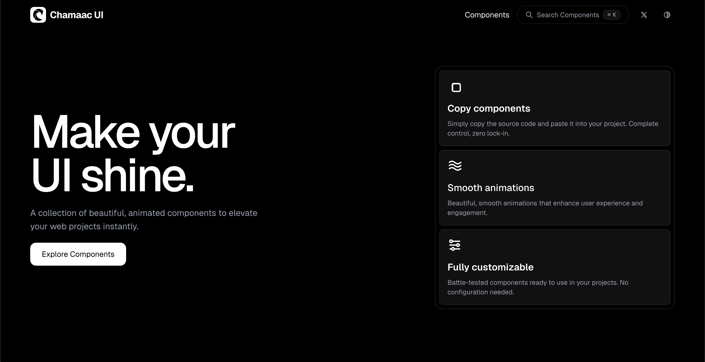

# Chamaac UI



A premium collection of modern, animated, and interactive UI components for Next.js applications. Built with Tailwind CSS and Motion, Chamaac UI is designed to help you build stunning, high-performance web interfaces with ease.

## Features

- **Premium Design**: Carefully crafted components with a focus on aesthetics and user experience.
- **Modern Stack**: Built on top of Next.js, Tailwind CSS, and Motion.
- **Copy & Paste**: Designed to be easily integrated into your existing projects.
- **Fully Customizable**: Flexible components that adapt to your design system.

## Getting Started

### Installation

1. Clone the repository:

```bash
git clone https://github.com/amarnath666/chamaacui.git
```

2. Install dependencies:

```bash
bun install
```

3. Run the development server:

```bash
bun run dev
```

## Contributing

We welcome contributions from the community. Please read our [Contribution Guidelines](CONTRIBUTING.md) to get started.

## License

This project is licensed under the MIT License.
